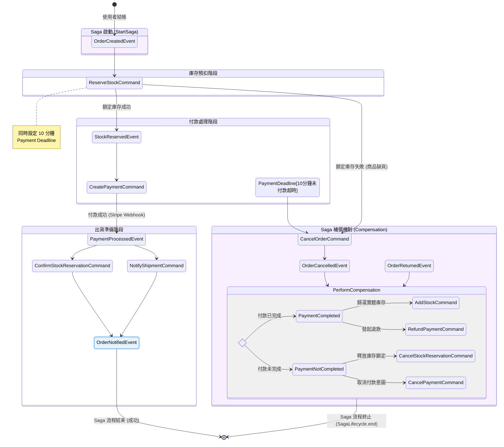

# E-Commerce Platform (with Recommender System) 🚀

這是一個完整的現代化電子商務平台，結合了先進的 **大數據推薦系統** 與 **微服務架構**，提供從商品瀏覽、個人化推薦到購物車與結帳的完整電商閉環體驗。

## 🌟 核心特色 (Core Features)

1. **電商完整閉環**: 涵蓋商品型錄、庫存鎖定、購物車管理、Stripe 金流整合，以及訂單狀態生命週期管理。
2. **分散式交易 (Saga Pattern)**: 透過 Saga 模式完美協調訂單、庫存與付款等多個微服務，並具備完善的失敗退款與庫存補償機制。
3. **個人化推薦引擎**: 結合使用者的瀏覽與加入最愛行為，透過 Spark ALS 模型進行協同過濾運算，提供亞毫秒級的個人化商品推薦。

## 🚀 技術架構 (Technology Architecture)

本專案採用最先進的雲端原生與大數據技術棧建構：

- **微服務與事件溯源**: 核心業務基於 **Spring Boot 3** 與 **Axon Framework** 構建，大量運用 CQRS 與 Event Sourcing 模式。
- **事件驅動 (Event-Driven)**: 引入 **Apache Kafka**，將使用者行為日誌採集升級為即時串流處理，與推薦系統完美解耦。
- **現代資料湖倉 (Modern Data Lakehouse)**: 採用輕量級、S3 相容的 **MinIO**，並搭配 **Apache Iceberg** 實作具備 ACID 交易能力的資料湖倉。
- **極速快取 (Ultra-Fast Cache)**: 以純記憶體的 **Redis** 作為推薦引擎快取，提供亞毫秒級的查詢效能。

### 🛍️ 電商交易核心 (CQRS & Event Sourcing)
基於 **Axon Framework** 構建，大量運用 CQRS 與 Event Sourcing 模式處理核心業務。
- **`product-service`**: 商品與設定微服務。負責管理商品型錄、分類設定 (Type/SubType)、使用者最愛清單，並維護商品狀態與可用庫存的查詢視圖 (Read Model)。
- **`order-service`**: 訂單微服務。負責購物車與訂單建立，並實作 **Saga 模式 (`OrderManagementSaga`)** 作為分散式交易的 Orchestrator，協調庫存與付款。
- **`inventory-service`**: 庫存微服務。管理實體庫存水位，處理鎖定庫存 (Reserve)、確認扣減 (Confirm)、取消鎖定 (Cancel) 及庫存歸還等指令。
- **`payment-service`**: 付款微服務。模擬第三方金流串接，處理付款成功、失敗及退款。
- **`shared-apis`**: 跨服務共用的 API 模組 (如 `inventory-api`, `payment-api`)，統一定義 Domain Commands 與 Events。

#### 🔄 OrderManagementSaga 分散式交易流程

以下流程圖展示了 `OrderManagementSaga` 如何協調 `order-service`、`inventory-service` 與 `payment-service`：

### 📊 數據與推薦引擎 (Data & Recommendation)
- **`behavior-service`**: 行為採集服務。蒐集前端使用者的瀏覽 (VIEW)、加入最愛 (FAVORITE) 等行為 (準備對接 Kafka)。
- **`recommendation-service`**: 推薦引擎服務。提供個人化推薦清單 (準備對接 Redis)。
- **`spark-recommender`**: 離線推薦模型運算模組。

### 🌐 介面端 (Frontend)
- **`e-commerce-frontend`**: Angular 前端應用程式。涵蓋首頁商品展示、推薦側邊欄、購物車管理與結帳流程。

*(更多啟動與開發指南，將於後續架構補齊後更新於此)*
