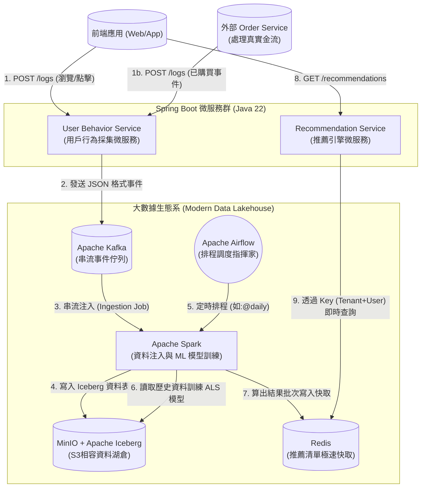

# 系統架構設計 (Modern Data Lakehouse Edition)

這份文件詳細描述了「電商推薦系統」在全面轉向事件驅動與湖倉一體化 (Modern Data Lakehouse) 後的服務拆分、外部依賴以及整體的資料流向。本系統完全拋棄了傳統笨重的 Hadoop/HBase，改為採用更加輕量、彈性且雲端原生的組件。

---

## 1. 系統架構圖 (Architecture Diagram)

以下是透過 Mermaid 繪製的系統架構圖，展示了從用戶端發送請求，經過微服務，再進入大數據生態系進行處理，最後提供推薦查詢的完整流程：

---

## 2. 微服務規劃 (Microservices Planning)

根據 Bounded Context 設計，系統劃分為以下核心微服務：

### 2.1 User Behavior Service (用戶行為採集微服務)
*   **定位**：負責接收極高併發的前端與外部系統行為打點請求，首要任務是「不掉資料」與「低延遲回覆」。
*   **技術要點**：
    *   **無狀態 (Stateless)**：易於橫向擴展 (Scale-out) 以應對大流量。
    *   **事件驅動**：將接收到的行為轉換為 Domain Event，透過 Kafka 生產者 API 即時非同步寫入 `user-behavior-events` Topic，確保 API 延遲極低。

### 2.2 Recommendation Service (推薦引擎微服務)
*   **定位**：負責向前端提供即時的推薦清單。
*   **技術要點**：
    *   **依賴外部儲存**：高度依賴 Redis 作為 Read Model，透過組合 `TenantId` 與 `UserId` 形成字串 Key，進行亞毫秒級的高速點查 (Point Get)。
    *   **降級與容錯 (Fallback)**：當 Redis 異常，或者某個新使用者 (Cold Start) 尚無推薦結果時，微服務應降級回傳預設的熱門商品或最新商品。

---

## 3. 大數據生態系與角色定位 (交響樂團比喻)

本系統高度依賴部署的大數據生態系，整個批次處理架構可以想像成一個運作順暢的交響樂團：

### 3.1 🎼 Apache Airflow (交響樂指揮家)
* **職責**：調度與排程 (Orchestration & Scheduling)。
* **說明**：Airflow 本身不存放資料，也不執行繁重的計算。它透過 DAG 腳本，根據時間排程 (例如：每天半夜 `@daily`) 自動下達指令，透過 `DockerOperator` 喚醒相對應的運算容器 (Spark) 開始工作。

### 3.2 🧮 Apache Spark (天才數學家)
* **職責**：大數據運算引擎 (Compute Engine)。
* **說明**：Spark 是純粹的計算大腦，負責兩大任務：
  * **資料注入 (Ingestion)**: 將 Kafka 內的即時日誌批次寫入資料湖。
  * **批次推薦 (Batch Recommendation)**: 讀取歷史資料，運用矩陣分解 (ALS) 機器學習演算法，為每位使用者算出專屬推薦清單。計算完成後，Spark 容器自動銷毀。

### 3.3 📚 MinIO + Apache Iceberg (超大圖書館)
* **職責**：資料湖倉 (Data Lakehouse)。
* **說明**：取代傳統的 HDFS。MinIO 提供 S3 相容的物件儲存能力，而 Iceberg 提供 ACID 交易支援與表結構定義。使用者的點擊、購買等所有行為歷史資料，都在這裡永久保存，作為 Spark 訓練模型的「教材」。

### 3.4 ⚡ Redis (高速佈告欄)
* **職責**：高效能分散式快取 (In-Memory Cache)。
* **說明**：取代傳統的 HBase。Spark 算好的推薦清單直接寫入 Redis。前端請求時，後端微服務能極速從 Redis 取得資料並回傳。

---

## 4. 資料庫 (Redis) 結構設計預覽

為了讓 Recommendation Service 達到最高查詢效率，Redis 的 Key-Value 結構設計如下：

*   **Redis Key Format**: `tenant:{tenantId}:user:{userId}:recs`
    *   範例: `tenant:TTRAVEL:user:nickgh@example.com:recs`
    *   *技術細節注意*: Spark 寫入時需確保字串純淨，過濾掉 Backend Serialize Value Object 時可能產生的 `{"value": "..."}` 包裝。
*   **Value Format**: JSON Array String
    *   範例: `[{"itemId":"P-1001","score":0.99}, {"itemId":"P-1002","score":0.85}]`

透過這個設計，Recommendation Service 只需要執行單一的 `GET` 指令就能一次拿回整個推薦陣列，時間複雜度為 O(1)，達成極致效能。
