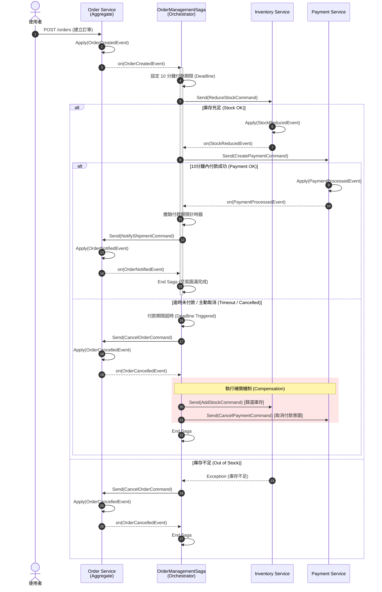

# 電商核心：Saga 分散式交易架構設計

本文件詳細描述 OmniStore 電商平台在處理核心交易（訂單、庫存、金流）時，基於 **領域驅動設計 (DDD)**、**CQRS (命令查詢職責分離)** 以及 **事件溯源 (Event Sourcing)** 所採用的微服務架構與分散式交易解決方案。

本架構完全獨立於大數據推薦系統，專注於確保跨服務交易的**資料一致性**與**高可用性**。

---

## 1. 核心微服務與職責 (Core Microservices)

在電商交易的核心鏈路上，系統將業務邏輯拆分為以下三個獨立的微服務：

1.  **Order Service (訂單服務)**：交易的起點與狀態機。負責管理訂單的生命週期 (`CREATED`, `APPROVED`, `SHIPPED`, `CANCELLED`)，並擔任 Saga 分散式交易的協調中心 (Orchestrator)。
2.  **Inventory / Product Service (庫存/商品服務)**：負責精準計算與鎖定商品庫存。處理訂單成立時的預扣 (Reservation) 與異常時的歸還 (Compensation)，防止超賣現象。
3.  **Payment Service (金流服務)**：處理買家的付款動作。負責產生支付意圖、驗證付款結果並處理後續可能的退款操作。

這些微服務皆為**無狀態 (Stateless)**，彼此之間不透過同步的 REST/gRPC API 呼叫，而是統一透過 **Axon Server** 進行非同步的 Command / Event 傳遞，達到徹底解耦。

---

## 2. 分散式交易模式：Saga Orchestration

在分散式系統中，傳統的 ACID 資料庫交易無法跨越微服務邊界。因此，我們採用 **Saga Pattern (Orchestration 機制)** 來確保最終一致性 (Eventual Consistency)。

由 `OrderManagementSaga` 擔任整個交易的總指揮，其運作流程與狀態轉移如下：

### 2.1 正常交易流程 (Happy Path)

1. **訂單建立**：使用者結帳，Order Service 聚合根發布 `OrderCreatedEvent`。
2. **啟動 Saga**：`OrderManagementSaga` 攔截到事件，開始運作：
   * 啟動 10 分鐘的「付款逾時」計時器 (DeadlineManager)。
   * 發送 `ReduceStockCommand` 給 Inventory Service。
3. **扣減庫存**：Inventory Service 成功扣庫存，發布 `StockReducedEvent`。
4. **建立付款**：Saga 接收到庫存成功事件，接著發送 `CreatePaymentCommand` 給 Payment Service。
5. **完成付款**：使用者完成付款，Payment Service 發布 `PaymentProcessedEvent`。
6. **通知出貨**：Saga 收到付款成功事件，取消 10 分鐘計時器，並發送 `NotifyShipmentCommand`。Order Service 將訂單狀態改為準備出貨 (`APPROVED`/`SHIPPED`)，Saga 功成身退。

### 2.2 異常補償機制 (Compensation & Inverse Flow)

Saga 最強大的地方在於處理跨服務失敗時的「退回機制 (Rollback)」，確保資料不會處於中間的不一致狀態：

* **情境 A：庫存不足**
  若 `ReduceStockCommand` 失敗拋出異常，Saga 會攔截異常並發送 `CancelOrderCommand` 給 Order Service，直接取消該訂單。
* **情境 B：付款逾時 (Timeout)**
  若超過 10 分鐘未收到付款成功事件，Saga 的 DeadlineHandler 會被觸發，強制發送 `CancelOrderCommand` 取消訂單。
* **情境 C：訂單取消 / 退貨 (Refund)**
  無論是使用者主動取消 (`OrderCancelledEvent`) 還是退貨 (`OrderReturnedEvent`)，Saga 都會執行統一的 `performCompensation` 邏輯：
  1. 對所有已保留的商品發送 `AddStockCommand` (歸還庫存)。
  2. 若已完成付款，發送 `RefundPaymentCommand` (退款)；若尚未完成，則發送 `CancelPaymentCommand` (取消付款意圖)。

---

## 3. 系統交易時序圖 (Sequence Diagram)

以下是透過 Mermaid 繪製的核心交易時序圖，展示了 Saga 如何協調各個微服務：

---

## 4. 關鍵技術架構保證

1. **併發保護與競態條件防禦 (Race Condition Prevention)**：
   在 `OrderManagementSaga` 中，我們透過 `isCancelling` 旗標與 `synchronized` 區塊，確保在非同步環境下（例如使用者手動點擊取消的同時發生了系統逾時），不會重複發送多次的庫存歸還或退款指令。
2. **容錯與重試保證 (Fault Tolerance)**：
   Axon Server 作為 Event Bus，負責事件的持久化。若某個微服務（例如 Inventory Service）暫時當機，Command 會被 Axon 暫存，等待服務重啟後繼續執行，確保 Saga 流程絕對不會卡在中間狀態。
3. **冪等性 (Idempotency)**：
   Saga 中實作的補償邏輯 (`performCompensation`) 是基於已完成的事件紀錄 (`reservedItems`) 進行動態判斷，保證只會歸還「真正有扣減到」的庫存，避免錯誤的資料覆寫。
